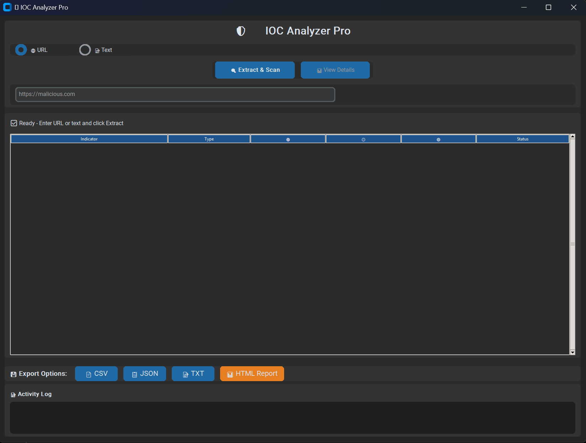
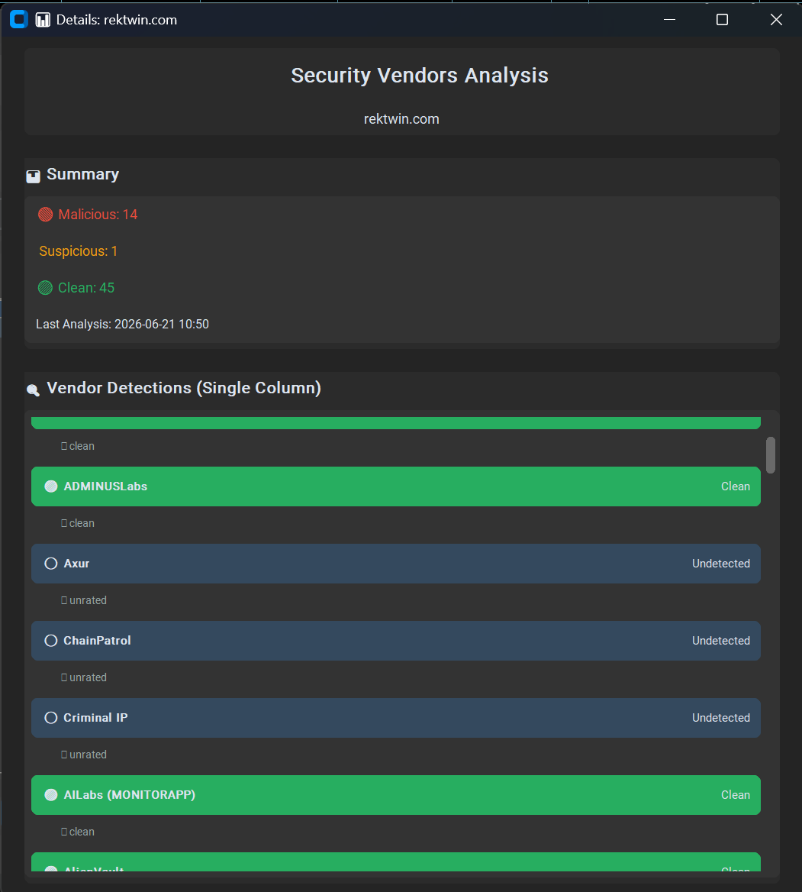
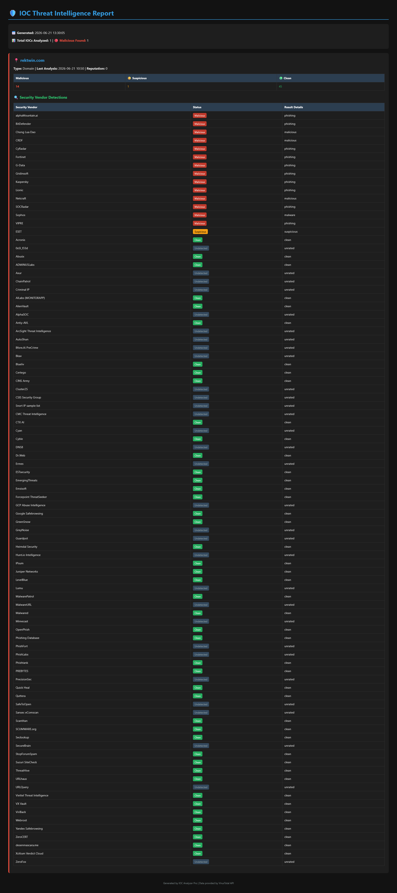

# 🛡️ IOC Analyzer Pro

A professional-grade, desktop GUI application for automated Indicators of Compromise (IOC) extraction and threat intelligence analysis. Built for SOC analysts and security researchers to streamline the triage of suspicious URLs, phishing emails, and server logs.


---

## 🎯 Overview

Manually copying and pasting IPs and domains from suspicious text into threat intelligence platforms is time-consuming. **IOC Analyzer Pro** automates this workflow. It extracts IOCs using advanced Regex, bypasses basic JavaScript obfuscation by extracting domains directly from URLs, and enriches them with real-time threat data from the VirusTotal API.

## ✨ Key Features

###  Smart Extraction & Parsing
- **Dual Input Modes:** Analyze pasted raw text (emails, logs) or scan live URLs.
- **URL Domain Extraction:** Automatically extracts the root domain from a URL, ensuring malicious sites are flagged even if their content is heavily obfuscated or hidden in JavaScript.
- **Regex Filtering:** Automatically identifies and deduplicates IPv4 addresses and domains, while filtering out private/internal IPs (RFC 1918).

### 🛡️ Threat Intelligence Integration
- **VirusTotal API v3:** Fetches real-time reputation scores, categories, and tags.
- **Detailed Vendor Analysis:** View exactly which security engines (e.g., Forcepoint, ESET, Fortinet) flagged the IOC as malicious, suspicious, or clean.
- **Rate Limit Handling:** Built-in asynchronous delays to respect the free-tier API limits (4 requests/minute).

### 🖥️ Modern GUI & Workflow
- **Dark-Themed Interface:** Built with CustomTkinter for a modern, professional cybersecurity aesthetic.
- **Compact Layout:** Input at the top, compact results table in the middle, and activity logs at the bottom.
- **Detailed View Modal:** Double-click any IOC to open a dedicated window showing full vendor detections in a clean, single-column scrollable list.
- **Persistent History:** Automatically saves all scans to a local JSON file for future reference and auditing.

### 💾 Comprehensive Export Options
- **CSV:** Quick spreadsheet export for basic reporting.
- **JSON:** Full data dump including all API metadata for further programmatic analysis.
- **TXT:** Human-readable detailed report with vendor breakdowns.
- **HTML:** Professional, color-coded web report ready to be shared with management or clients.

---

## 📸 Screenshots

*(Replace these placeholders with actual screenshots of your tool!)*

| Main Interface | Detailed Vendor View | HTML Export Report |
| :---: | :---: | :---: |
|  |  |  |

---

##  Getting Started

### Prerequisites

- Python 3.8 or higher
- A free **VirusTotal API Key** ([Get one here](https://www.virustotal.com/gui/my-apikey))

### Installation

1. **Clone the repository:**
   ```bash
   git clone https://github.com/yourusername/ioc-analyzer-pro.git
   cd ioc-analyzer-pro